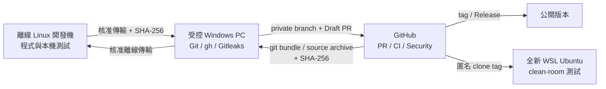

# GitHub 發布與離線開發環境作業手冊

本文件供維護者執行初次開源、後續版本發布、GitHub 安全設定，以及將 GitHub 成果同步回無法連外的 Linux 開發機。

同事說明簡報另行保存，不納入本 repository。

本專案的特殊限制是：

- Linux 開發機無法連線 GitHub、Packagist 或其他外部服務。
- 所有 GitHub 操作由一台可連外的受控 Windows PC 執行。
- Windows PC 使用 PowerShell 5.1、Git、GitHub CLI（`gh`）與 Gitleaks。
- 公開發布前以 WSL 內的全新 Ubuntu 做 clean-room 安裝與完整測試。

> **核心原則**
>
> 1. 初次匯入前，Linux 開發機是來源；第一個 PR 合併後，GitHub `main` 改為唯一真實來源。
> 2. 傳輸的每個檔案都要有 SHA-256；來源、雜湊、目的端三者必須可追溯。
> 3. 不直接 push `main`；所有變更經 branch、PR、CI、審查後 squash merge。
> 4. `.env`、主金鑰、正式資料、上傳檔與 runtime 絕不進 Git 或傳到 GitHub。
> 5. GitHub 上已更新的 `composer.lock` 不得被離線開發機的舊檔反向覆蓋。

---

## 1. 作業架構



### 1.1 角色

- **正式維護單位**：核准公開、版本號、授權與安全政策。
- **Linux 開發機操作人員**：執行本機測試、清理與輸出來源包。
- **Windows PC 操作人員**：驗證雜湊、執行 Git/GitHub 操作與留存紀錄。
- **PR 審查者**：確認差異、測試、授權、敏感資料與發布內容。

### 1.2 停止條件

遇到下列任一情況立即停止，不得公開或打 tag：

- 雜湊不一致。
- Gitleaks、GitHub Secret Scanning 或人工檢查發現秘密。
- `composer audit`、CI 或 clean-room 測試失敗。
- PR 不是 `CLEAN` / `MERGEABLE`。
- Dependabot 有未完成分流的 Critical/High 警示。
- GitHub branch protection、Private Vulnerability Reporting 或必要安全功能未啟用。
- Windows PC 工作樹不乾淨，或 HEAD 與遠端 branch SHA 不一致。

---

## 2. 工具與版本

Windows PC 至少安裝：

```powershell
git --version
gh --version
gitleaks version
wsl --version
```

工具安裝檔應從官方 release 取得並核對官方 SHA-256。GitHub CLI 登入後確認：

```powershell
gh auth status
gh repo view AS-ITS/evoting --json viewerPermission,visibility,defaultBranchRef
```

WSL 建議：

- WSL 2
- Ubuntu 24.04 LTS
- PHP 8.3（額外驗證高於 CI PHP 8.2 的相容性）
- MariaDB 10.11
- Composer 2

---

## 3. 離線 Linux 開發機：發布前準備

### 3.1 完整測試

測試只能指向測試資料庫：

```bash
bash tests/run-all.sh
```

Acceptance 需另開測試伺服器：

```bash
php -S localhost:8080 -t web web/router-test.php \
  > /tmp/evoting-acceptance-server.log 2>&1 &
SERVER_PID=$!

RUN_ACCEPTANCE=1 bash tests/run-all.sh
TEST_EXIT=$?

kill "$SERVER_PID"
exit "$TEST_EXIT"
```

基準紀錄見 [`tests/TEST_STATUS.md`](../tests/TEST_STATUS.md)。2026-10-07 開源前基準為：

- Unit：1174 tests / 6659 assertions
- Functional：190 tests / 395 assertions
- Acceptance：120 tests / 254 assertions
- 合計：1484 tests / 7308 assertions

### 3.2 開源清理

```bash
bash scripts/open-source-prep.sh
```

確認：

- runtime 已清空並重建必要目錄。
- `.env`、`master.key` 未被納管。
- `web/phpinfo.php`、備份檔等危險檔不存在。
- `composer.lock`、`LICENSE` 存在。
- Webix 等已移除資產沒有殘留。

### 3.3 秘密與依賴檢查

```bash
gitleaks dir . --config .gitleaks.toml --redact --no-banner
composer validate --strict
composer audit
composer licenses
```

若開發機不能安裝 Gitleaks，必須在 Windows PC 解壓後補做目錄與 Git 歷史掃描。

### 3.4 建立傳輸包

只封裝原始碼；不要包含 `.env`、`vendor/`、runtime 內容、上傳檔、資料庫或主金鑰。

```bash
RELEASE_DATE="$(date +%Y%m%d-%H%M)"
ARCHIVE="evoting-source-${RELEASE_DATE}.tar.gz"

tar \
  --exclude='.env' \
  --exclude='.git' \
  --exclude='vendor' \
  --exclude='runtime/*' \
  --exclude='web/assets/*' \
  --exclude='tests/_output/*' \
  -czf "$ARCHIVE" .

sha256sum "$ARCHIVE" > "${ARCHIVE}.sha256"
```

將 archive 與 `.sha256` 透過核准媒介傳到 Windows PC。兩個檔案不可分開經由不同、不可追溯的來源取得。

---

## 4. Windows PC：接收、驗證與匯入

### 4.1 驗證 SHA-256

```powershell
$Archive = "C:\path\to\evoting-source-YYYYMMDD-HHMM.tar.gz"
$Expected = (
  Get-Content "$Archive.sha256"
).Split(" ")[0].Trim().ToLowerInvariant()

$Actual = (
  Get-FileHash $Archive -Algorithm SHA256
).Hash.ToLowerInvariant()

if ($Actual -ne $Expected) {
  throw "來源包 SHA-256 不一致"
}
```

不要在雜湊失敗時「重新計算並覆蓋 expected」；應回到來源端重新確認。

### 4.2 GitHub repo 必須先保持 private

初次建立 repository 時：

- visibility：Private
- default branch：`main`
- 不直接匯入 production secrets
- 初次發布 branch：`release/open-source-v1`
- PR：Draft

後續一般版本使用：

```powershell
git switch main
git pull --ff-only
git switch -c release/vX.Y.Z
```

### 4.3 解壓與加入 Git

在 WSL 或可保留 Unix 權限的 tar 工具中解壓。不要用會任意改寫 symlink 或 executable bit 的 GUI 解壓流程。

```powershell
git status --short
git add --all
git diff --cached --check
git diff --cached --stat
```

檢查：

- `yii` 等執行檔 mode 正確。
- `.env`、runtime、資料庫 dump、上傳檔未 staged。
- `vendor/` 未 staged。
- `.gitignore` 沒有誤擋必要來源檔。

可用下列命令追查 ignore 來源：

```powershell
git check-ignore -v path/to/file
```

---

## 5. Windows 與 Git 掃描

### 5.1 目錄掃描

```powershell
gitleaks dir . `
  --config ".gitleaks.toml" `
  --redact `
  --no-banner
```

### 5.2 Git 歷史掃描

```powershell
gitleaks git . `
  --config ".gitleaks.toml" `
  --redact `
  --no-banner
```

### 5.3 Git 完整性

```powershell
git fsck --full
```

`dangling blob` 通常是本機曾 staged/改寫後留下的不可達物件，不代表已推送。仍需確認：

```powershell
git rev-parse HEAD
git rev-parse origin/<branch>
```

兩個 SHA 必須相同。

---

## 6. Composer 與 vendor patch

Windows 或連網 WSL 執行：

```bash
composer validate --strict
composer install --no-interaction --prefer-dist
composer check-platform-reqs
php scripts/apply-vendor-patches.php
composer audit
composer licenses
```

第二次執行 patch 應顯示 `already applied`，證明冪等：

- `yiisoft-yii2-QueryBuilder-resetSequence.patch`
- `codeception-Gherkin-default-keywords.patch`

`vendor/` 不進 Git。套 patch 失敗時 Composer 安裝必須失敗，不可手改 `vendor/` 後繼續發布。

---

## 7. GitHub PR 與 CI

### 7.1 CI 必要條件

目前 CI 以 Ubuntu 24.04、PHP 8.2、MariaDB 10.11 執行：

- `test`：unit + functional
- `composer licenses + audit`
- `permissions: contents: read`
- CI 動態產生並 mask `MASTER_KEY`
- `APP_PATH_UPLOADS` 指到 `${{ github.workspace }}/runtime/filepool`
- 預建 `runtime/sessions/test`、cache、logs、debug、filepool
- `actions/checkout@v7`

Acceptance 不在 GitHub CI，須在開發機或 clean-room WSL 執行。

### 7.2 建立 PR

```powershell
git commit -m "Prepare release vX.Y.Z"
git push --set-upstream origin release/vX.Y.Z

gh pr create `
  --base main `
  --head release/vX.Y.Z `
  --title "Prepare vX.Y.Z release" `
  --body "Finalize the vX.Y.Z release."
```

初次公開時 PR 維持 Draft，repo 維持 private，直到所有 gate 通過。

### 7.3 監看 CI

剛 push 時 `gh pr checks --watch` 可能回報 `no checks reported`；這是 GitHub 尚未建立 check run，不代表 workflow 沒有觸發。

```powershell
Start-Sleep -Seconds 15
gh run list --branch release/vX.Y.Z --limit 3
gh run watch <RUN_ID> --exit-status
```

### 7.4 合併

以 HEAD 鎖避免合併到非預期 commit：

```powershell
$Head = git rev-parse HEAD

gh pr merge <PR_NUMBER> `
  --squash `
  --delete-branch `
  --match-head-commit $Head `
  --subject "Release vX.Y.Z"
```

合併後必須再等 `main` push CI 全綠。

---

## 8. GitHub 公開與安全設定

### 8.1 Repo metadata

建議：

- Description：MIT 授權的 Yii2 電子投票平台，支援表決投票與匿名投票。
- Topics：`electronic-voting`、`e-voting`、`voting-system`、`anonymous-voting`、`yii2`、`php`、`mariadb`
- Issues：Enabled
- Wiki：Disabled
- Merge：Squash only
- Delete branch on merge：Enabled

### 8.2 visibility 轉換

免費方案的 private repo 可能無法先啟用 branch protection，Private Vulnerability Reporting 也只能在 public repo 啟用。因此順序為：

1. 所有程式與 CI gate 先在 private / Draft 完成。
2. 切為 public。
3. 立即啟用 Private Vulnerability Reporting。
4. 立即設定 branch protection。
5. 立即啟用 Secret Scanning、Push Protection、Dependabot alerts/security updates。

```powershell
gh repo edit AS-ITS/evoting `
  --visibility public `
  --accept-visibility-change-consequences

gh api `
  --method PUT `
  repos/AS-ITS/evoting/private-vulnerability-reporting `
  --silent
```

visibility 轉換後短時間可能回 `Repository has been locked`。等待約 30 秒後確認 repo 狀態，再重試一次；不要連續暴力重試。

### 8.3 Branch protection

必要設定：

- strict required status checks
- `test`
- `composer licenses + audit`
- admins 也受規則約束
- PR required
- linear history
- conversation resolution
- 禁止 force push
- 禁止刪除 `main`

目前為避免單一維護者被鎖死，`required_approving_review_count` 可暫設 `0`；當至少有兩位可審查維護者時，應改為 `1`，以符合 [`CONTRIBUTING.md`](../CONTRIBUTING.md) 的審查政策。

Windows PowerShell 5.1 將 JSON 經 native pipe 傳給 `gh` 可能造成編碼錯誤。使用 UTF-8 無 BOM 暫存檔：

```powershell
$Utf8NoBom = New-Object Text.UTF8Encoding($false)
$ProtectionFile = Join-Path $env:TEMP "evoting-main-protection.json"
$ProtectionJson = $Protection |
  ConvertTo-Json -Depth 10 -Compress

[IO.File]::WriteAllText(
  $ProtectionFile,
  $ProtectionJson,
  $Utf8NoBom
)

gh api `
  --method PUT `
  repos/AS-ITS/evoting/branches/main/protection `
  --input $ProtectionFile `
  --silent

Remove-Item $ProtectionFile
```

### 8.4 安全功能

```powershell
gh repo edit AS-ITS/evoting `
  --enable-secret-scanning `
  --enable-secret-scanning-push-protection

gh api --method PUT `
  repos/AS-ITS/evoting/vulnerability-alerts `
  --silent

gh api --method PUT `
  repos/AS-ITS/evoting/automated-security-fixes `
  --silent
```

確認 open alerts：

```powershell
gh api `
  "repos/AS-ITS/evoting/dependabot/alerts?state=open&per_page=100" `
  --jq 'length'

gh api `
  "repos/AS-ITS/evoting/secret-scanning/alerts?state=open&per_page=100" `
  --jq 'length'
```

發布前兩者都應為 `0`，或每一筆都有正式風險接受紀錄。

---

## 9. CHANGELOG、tag 與 GitHub Release

### 9.1 版本文件

發布前將 `[Unreleased]` 項目歸入：

```text
## [X.Y.Z] - YYYY-MM-DD
```

CHANGELOG 變更仍須走 PR 與 CI，不能在受保護的 `main` 直接 commit。

### 9.2 Annotated tag

```powershell
$ReleaseCommit = git rev-parse HEAD

git tag `
  --annotate vX.Y.Z `
  $ReleaseCommit `
  --message "vX.Y.Z"

git push origin refs/tags/vX.Y.Z
git rev-list -n 1 vX.Y.Z
```

最後一行必須等於已通過 `main` CI 的 SHA。

### 9.3 GitHub Release

```powershell
gh release create vX.Y.Z `
  --verify-tag `
  --latest `
  --title "vX.Y.Z" `
  --notes-file release-notes.md
```

Release notes 至少包含：

- 版本定位與主要功能。
- 支援的 PHP / MariaDB 範圍。
- 安裝文件連結。
- 重大安全或相容性變更。
- Private Vulnerability Reporting 指引。

---

## 10. Clean-room WSL 驗證

### 10.1 建立一次性 distro

不要沿用既有 Ubuntu、Windows clone、Composer cache 或 DB：

```powershell
wsl --install Ubuntu-24.04 `
  --name evoting-clean `
  --no-launch

wsl -d evoting-clean
```

安裝 PHP、MariaDB、Composer、Git 與必要 extensions 後，從公開 URL 匿名 clone 固定 tag：

```bash
cd ~

GIT_TERMINAL_PROMPT=0 git clone \
  --branch vX.Y.Z \
  --depth 1 \
  https://github.com/AS-ITS/evoting.git \
  evoting-release-test

cd evoting-release-test
git rev-parse HEAD
git describe --tags --exact-match
```

### 10.2 依賴驗證

```bash
composer validate --strict
composer install --no-interaction --prefer-dist --no-progress
composer check-platform-reqs
php scripts/apply-vendor-patches.php
composer audit
git status --short
```

`.env` 必須由 `.env.example` 複製後修改，不可自製精簡版而漏掉必要欄位：

```bash
cp .env.example .env
chmod 600 .env
```

至少設定：

- `APP_ENV=testing`
- `APP_ID=voting`
- `COOKIE_VALIDATION_KEY`
- 開發/測試用 `MASTER_KEY`
- `TEST_DB_*`
- `APP_PATH_UPLOADS`
- `ALLOWED_HOSTS`

### 10.3 DB 與測試

匯入 `docs/init_db.sql` 後：

```bash
bash tests/run-all.sh
```

Acceptance：

```bash
php -S localhost:8080 -t web web/router-test.php \
  > /tmp/evoting-acceptance-server.log 2>&1 &
SERVER_PID=$!

RUN_ACCEPTANCE=1 bash tests/run-all.sh
TEST_EXIT=$?

kill "$SERVER_PID"
exit "$TEST_EXIT"
```

測試完成後保存：

- distro / OS 版本
- PHP、Composer、MariaDB、Git 版本
- clone tag 與 SHA
- Composer audit 結果
- unit / functional / acceptance tests、assertions、exit code

### 10.4 清除一次性環境

確認結果與必要 log 已匯出後：

```powershell
wsl --terminate evoting-clean
wsl --unregister evoting-clean
```

`--unregister` 會永久刪除 distro，必須先確認沒有要保留的 log 或離線 artifact。

---

## 11. 將 GitHub 成果同步回離線開發機

公開後 **GitHub `main` 是唯一真實來源**。不能將 Linux 舊目錄直接打包覆蓋 GitHub。

### 11.1 在 Windows PC 建立 Git bundle

```powershell
git switch main
git pull --ff-only
git fetch --tags --prune

git bundle create `
  evoting-main.bundle `
  --all

git bundle verify evoting-main.bundle
Get-FileHash evoting-main.bundle -Algorithm SHA256
```

Git bundle 包含 history、branches 與 tags，適合建立離線 Git 工作目錄。

### 11.2 建立可部署 source archive

```powershell
git archive `
  --format=tar.gz `
  --prefix=evoting-vX.Y.Z/ `
  --output=evoting-vX.Y.Z-source.tar.gz `
  vX.Y.Z

Get-FileHash `
  evoting-vX.Y.Z-source.tar.gz `
  -Algorithm SHA256
```

### 11.3 vendor 離線包

在 clean-room WSL 以相同 tag 執行 `composer install` 並通過測試後，才封裝 `vendor/`：

```bash
tar -czf evoting-vX.Y.Z-vendor-dev.tar.gz vendor
sha256sum evoting-vX.Y.Z-vendor-dev.tar.gz
```

正式部署另建 `--no-dev --optimize-autoloader` 的 production vendor 包；不要把 dev vendor 當 production artifact。

### 11.4 離線 Linux 匯入

建議建立新目錄，不直接覆蓋目前運行中的目錄：

```bash
sha256sum -c evoting-main.bundle.sha256
git clone evoting-main.bundle evoting-next
cd evoting-next
git checkout main
git describe --tags --always
```

再依核准程序放入：

- 該環境自己的 `.env`
- 外部主金鑰路徑
- 對應 vendor 包
- 必要上傳資料與 DB migration

最後做 smoke test，再以 symlink 或正式變更程序切換。不要從 GitHub archive 帶入 `.env` 或 production 資料。

---

## 12. 本次實作踩坑與處理方式

### 12.1 Windows Git ignore 大小寫

問題：

```gitignore
/assets/[0-9a-f]*
```

Windows case-insensitive Git 將 `AppAsset.php`、`BootstrapSelectAsset.php`、`BootstrapStepsAsset.php`、`ComVerLibAsset.php` 視為 A–F 開頭並忽略。

修正：

```gitignore
/assets/[0-9a-f]*/
```

而且 `assets/.gitignore` 內的同類規則也必須加 `/`。只修 root `.gitignore` 不夠。

診斷：

```powershell
git check-ignore -v assets/AppAsset.php
```

### 12.2 過度寬鬆的 test ignore

`test.php` 等 pattern 會誤擋 `config/test.php`。應使用 root-anchored pattern：

```gitignore
/test.php
/debug.php
/debug_*.php
/temp.php
```

### 12.3 CI 可寫路徑

Functional test 會使用 `@filePool`。CI 必須明確設定：

```yaml
APP_PATH_UPLOADS: ${{ github.workspace }}/runtime/filepool
```

並建立 `runtime/filepool`。

### 12.4 CI 主金鑰

設定系統要求主金鑰。不可把固定 key 寫進 workflow；CI 應每次產生隨機 key、mask 後寫入 `$GITHUB_ENV`。

### 12.5 Codeception / Behat 相容性

直接升到 Codeception 5.3+ 會改變 PHP 8.0/8.1 支援策略。採用上游相容 patch，可保留 Codeception 5.1.2 與既有 PHP 相容範圍。

### 12.6 GitHub Actions 與 runner 警告

- `actions/checkout@v4` 有 Node 20 deprecation warning。
- 最終升到 `actions/checkout@v7`。
- `ubuntu-latest` 將遷移，故固定 `ubuntu-24.04`。

### 12.7 Dependabot 將 vendored build lockfile 視為產品依賴

三個前端套件以預先建置 CSS/JS 提供，應用程式、CI 與部署不執行 npm/yarn；其上游 lockfile 只描述過期 build-time devDependencies，導致約 60 筆不代表 runtime 的 alerts。

處理：

- 移除三個 build-only lockfile。
- `.gitignore` 防止再次納入。
- `frontend/README.md` 說明產品使用預先建置資產。
- 合併後等 dependency graph 重建，確認 open Dependabot alerts 為 0。

不可只批次 dismiss 而不留下技術理由。

### 12.8 Private repo 功能限制

GitHub 免費方案可能在 private repo 對 branch protection 回：

```text
Upgrade to GitHub Pro or make this repository public
```

Private Vulnerability Reporting 在 private repo 也可能回 404。先完成 private gate，公開後立即補設定。

### 12.9 visibility 轉換暫時鎖定

切 public 後立即呼叫 protection API 可能回：

```text
Repository has been locked
```

這通常是轉換處理中的暫態狀態。等待、唯讀確認 `visibility=public` 且 `archived=false`、`disabled=false`，再重試一次。

### 12.10 PowerShell 5.1 JSON pipe

`ConvertTo-Json | gh api --input -` 可能因 native pipe encoding 得到：

```text
Problems parsing JSON
```

解法是以 `.NET UTF8Encoding($false)` 寫入無 BOM 暫存檔，再用 `--input <file>`。

### 12.11 WSL distro 共用 port

不同 WSL distro 同時啟動 MariaDB 時，`3306` 可能衝突：

```text
Bind on TCP/IP port. Got error: 98: Address already in use
```

停止不用的 distro，或讓 clean-room DB 使用獨立 port。不要在未確認服務身份時，對 `127.0.0.1:3306` 建 DB 或改帳號。

### 12.12 APP_ID 與 session name

若 clean-room clone 目錄含 `.`，又自製精簡 `.env` 漏掉 `APP_ID`，系統可能從目錄名稱產生不合法 session name：

```text
session.name cannot contain any of '=,;.[ ...'
```

正確作法是 `cp .env.example .env`，保留 `APP_ID=voting` 後再修改環境值。

### 12.13 LF / CRLF

Windows 出現 `LF will be replaced by CRLF` 警告不等於內容錯誤，但提交前必須執行：

```powershell
git diff --cached --check
```

只修真正的 trailing whitespace；不要為了消除訊息而整批重寫所有來源檔。

---

## 13. 每次發布最小檢查表

發布前：

- [ ] 版本與 CHANGELOG 已核准
- [ ] Linux / WSL 完整測試全綠
- [ ] `scripts/open-source-prep.sh` 通過
- [ ] Composer validate / audit / licenses 通過
- [ ] Gitleaks directory + Git history 為 0
- [ ] 傳輸 archive SHA-256 一致
- [ ] PR diff、HEAD SHA 與遠端一致
- [ ] PR CI 全綠
- [ ] `main` post-merge CI 全綠
- [ ] Dependabot / Secret Scanning open alerts 為 0 或有核准紀錄
- [ ] branch protection / PVR / Push Protection 已啟用
- [ ] annotated tag 指向已驗證的 `main` SHA
- [ ] GitHub Release 非 Draft / 非 Prerelease（正式版）
- [ ] Git bundle、source archive、vendor artifact 已產生並保存 SHA-256
- [ ] GitHub `main` 成果已依核准流程同步回離線開發機

---

## 14. 首次公開版本紀錄

- Repository：<https://github.com/AS-ITS/evoting>
- Initial PR：<https://github.com/AS-ITS/evoting/pull/1>
- Release PR：<https://github.com/AS-ITS/evoting/pull/3>
- Release：<https://github.com/AS-ITS/evoting/releases/tag/v1.0.0>
- Tag：`v1.0.0`
- Release commit：`ac9fb96fdeab8bada0ce6428b2e5ac2f05e14f6b`
- Published：2026-10-08
- GitHub CI：unit + functional、Composer licenses + audit 全綠
- GitHub security：Dependabot alerts 0、Secret Scanning alerts 0
- Clean-room WSL：全套通過
  - Ubuntu 24.04.5 LTS / x86_64
  - PHP 8.3.6
  - Composer 2.7.1
  - MariaDB 10.11.14
  - Git 2.43.0
  - 匿名 clone `v1.0.0`，HEAD 為 `ac9fb96fdeab8bada0ce6428b2e5ac2f05e14f6b`
  - `composer install`、platform requirements、vendor patches 冪等性、Composer audit 全部通過
  - Unit：1174 tests / 6659 assertions
  - Functional：190 tests / 395 assertions
  - Acceptance：120 tests / 254 assertions
  - 合計：1484 tests / 7308 assertions，所有 exit code 為 0
