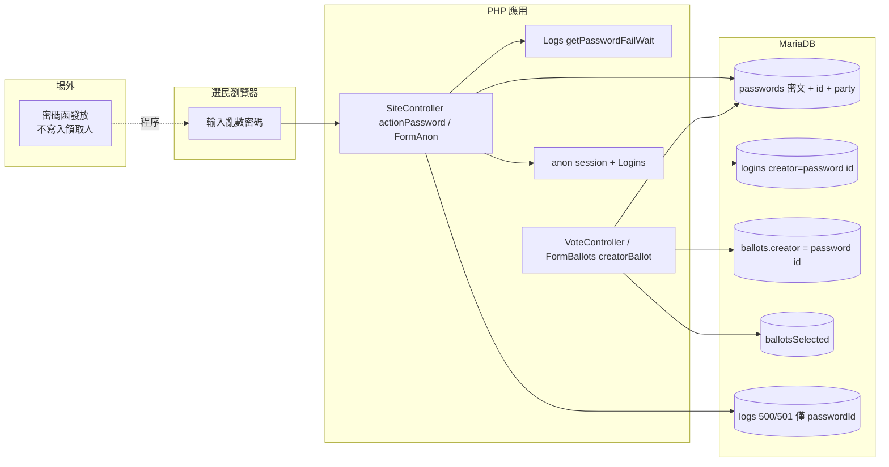
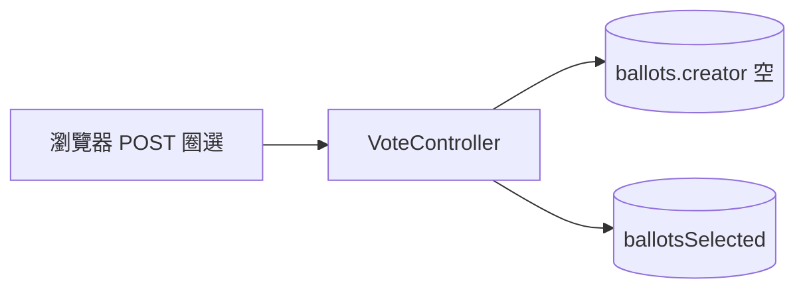
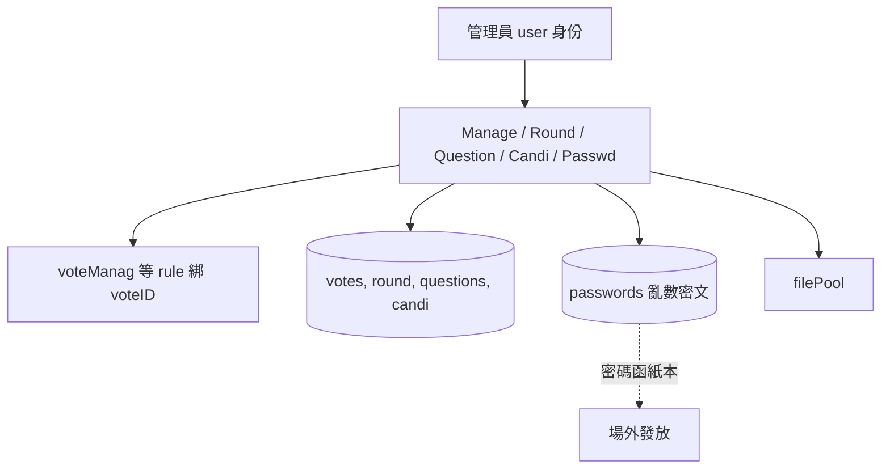
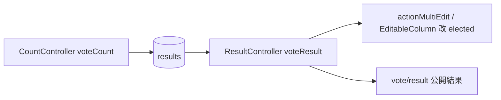
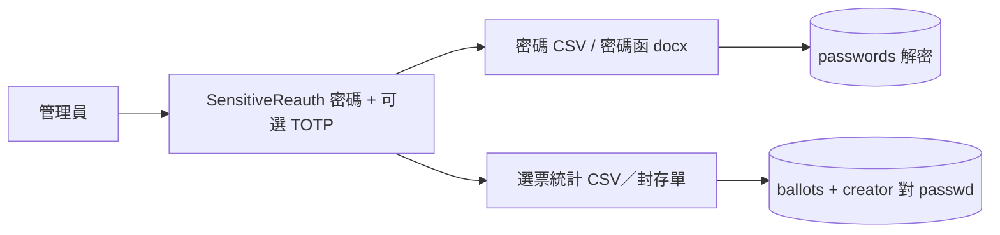

# 資料流圖（DFD）

> 上層：[README.md](README.md)　對應程式以註解標路徑，非逐步攻擊手冊。

圖例：實線＝系統資料；虛線＝場外程序（不寫入身分）。

## DFD 1 — 匿名登入 → 圈選 → 寫入選票

最高優先。匿名保證在此流成立或失敗。

要點：

- 登入成功後 `authData['id']` 進 session。
- `FormBallots::creatorBallot()` 把 `creator` 設成該 id，並可呼叫 `FormPasswords::setVote()`。
- `FormAnon::buildLoginLogContext()` 只記 `voteID`、`passwordId`，不含明文。`LogSanitizer` 再擋 `password`／`passwd` 等鍵。
- **沒有**「選民 Users 表」參與此流。

## DFD 2 — 表決（無驗證）投票

無選民憑證。完整性／防灌票不在應用身份層（假設 A5）。

## DFD 3 — 管理員設定場次／密碼產生

`passwords.mark` 是批次標記，**不是**身分欄。若填入姓名，破壞 A2（見 04）。

## DFD 4 — 開票 → 結果編輯

`actionMultiEdit` 只檢查 `voteResult`，不走 Sensitive Reauth（**已決議不加**：開票需人為判斷）。

## DFD 5 — 敏感匯出（密碼／選票統計）

匯出證明的是「憑證 ↔ 選票」，供紙本封存與雙軌對帳。**仍無人名。** 若匯出檔與場外領取名單放在一起，匿名在場外被破，不是這條 API 多寫了身分欄。
